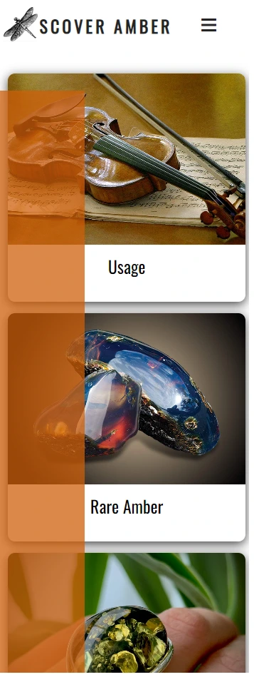

<h1 align="center">DISCOVER AMBER</h1>

[View the live project here](https://elainebroche-dev.github.io/ms1-thrive/)

Welcome to my website **Discover Amber** dedicated to promoting awareness about the beauty and value of amber! Amber is a natural fossilized resin that has been prized for thousands of years for its warm, golden colour and unique inclusions. My website is dedicated to providing accurate and informative information about this fascinating material, including its uses in art, jewellery and different industries; rare types. Whether you're a collector, students of arts and crafts, science or geology, or simply someone who appreciates the beauty of nature, I hope you'll find something of interest on this site. 

This website is first of five Milestone Projects required to complete the Diploma of Full Stack Software Development with The Code Institute. 

The main requirements of this project are to build a responsive and static front-end site to present useful information to users applying all of the technologies learned so far, namely HTML5 and CSS3. The site is to contain no less than three pages.

## Index – Table of Contents
* [User Experience (UX)](#user-experience-ux) 
* [Features](#features)
* [Design](#design)
* [Technologies Used](#technologies-used)
* [Testing](#testing)
* [Deployment](#deployment)
* [Credits](#credits)

# User Experience (UX)

### Ideal User Demographic

**THE IDEAL USER FOR THIS WEBSITE IS:**
* <ins>New user:</ins>
1. People who appreciate the beauty of natural materials, specifically amber
2. Jewellery enthusiasts who are interested in the uses of amber in art, jewellery and different industries   
3. Collectors of amber or other natural fossils
4. Someone who searching for inspirational idea for a present
5. Students of arts and crafts, science or geology
6. This site can be used by English speaking tourists visiting Kaliningrad Region of Russia located on a Baltic sea.
   The Kaliningrad Amber Combine is the only official amber mine in Russia and accounts for 65% of the global amber market. 
   Region holds 90% of the world's extractable amber. 
* Current user
* Returning user   

## **USER STORIES**
### CURRENT USER GOALS

###  <ins>First Time Visitor Goals</ins>
    
   Idealy, as a new user I want to be able to:
1. Experience easy and intuitive navigation through the site and access the information required.
2. Have the ability to navigate to content or retrieve previous viewed information within a small number of steps.
3. Experiense relevant and attractive content acompanied by the colour schemes compatible the content.
4. Get a source of reliable and accurate information about amber.
5. Learn about the beauty and value of amber, and its unique properties and characteristics.
6. Discover the various uses of amber in different industries, art and jewellery.
7. Get inspired by the beauty of amber and nature.
8. Find ideas for amber gifts, office or home decorative and practical items.
9. Have access to contact points in case of any queries or to communicate for any reason.
10. Learn about the significance of Kaliningrad Region of Russia in the global amber market.
11. Understand the importance of amber in the fields of arts, crafts, science and geology.
      
  ### <ins>Returning Visitor Goals</ins>

   As a current user I want to be able to:
1. Discover the various uses of amber in different industries, art and jewellery 
2. Understand the unique characteristics of amber and learn about rare types
3. Gain inspiration from the beauty of amber and nature
4. Get ideas for amber gifts, office or home decorative and practical items
5. Get a source of reliable and accurate information about amber
6. I would like to experience easy and intuitive navigation through the site and access the information I require.
7. I would like to be able easily navigate to content or retrieve my steps to information I have previously viewed within a small number of steps.
8. Also, as a current user, I would appreciate ability of contact points in case I have queries or want to communicate for any reason.

##  **FEATURES**

### **Existing Features**

-   **Navigation Bar**

    - The navigation bar has a consistent look and placement on all five pages of the website supporting easy navigation.
    
      It includes a simple Logo, HOME, USAGE, RARE AMBER, GIFRS and CONTACT ME links and is responsive on multiple screen sizes.  
         
    - *On a large* screens tabs for all pages are visible;
    
      
    - *Active page* tab is identified as a button of orange colour;
    
      
    - *During navigation* through the tabs user is assisted by change of tab colour on hover to green
    - Navigation through *Medium and Small screens* assisted by a 'hamburger' drop-down menu with transparent colour matching background and colour distinguished tabs
       
      (the decision about 'hamburger' menu has been implemented to avoid nav bar going into two and more lines, and to save space on smalle screens)
    
       

      
    
      

-   **The Landing Page Animated panels, Logo and call to action**

    - Home Page has been equipped with three side-by-side animated (expanding on hover) panels. These panels are: USAGE, RARE AMBER and GIFTS. Panels are serving not just as a visual fixture, but thematically linked to relevant pages and can be used as navigation points to these pages. There is cursor pointer on hover to guide a user.

    - The choice of images on the Landing Page was not accidental. Images were selected to convey a sense of curiosity through an unusual (in relation to a traditional understanding of amber) objects like violin, beautiful blue stones and impressive ring with a green stone. On selection of the Landing Page images a colours chime has been taken in consideration too.  

     
    

-   **Logo**

    - **Discover Amber** - website Logo has been linked to home page for user convenience.   
    - The Logo **Discover Amber** in connection with Landing Page **animated panels**, occupying the central part of the screen, together are eye-catching call to action to go ahead and explore.  

-   **Gifts Page Image Gallery**

    - Images in the gallery are accompanied by information at the back of the image to provide user with a descriptive information about the materials were used to produce it, size and colour scheme. As the size of the images varies as well as the amount of the content, the information cards at the back of the images equipped by a scroll bar for convenience of the user.

    
    
    
-   **Back-to-top button** on Gifts Page

    - **Gifts Gallery** page equipped with back-to-top button to assist user and give opportunity to return to the top of the page in one click. 

      

-   **Footer**

    - For consistancy and intuativeness of brousing, as expected by user, **footer** has been placed at the bottom of all six pages (that including "Error" 404 page).
      - Footer provides user with an oportunity to follow the website on social media platforms.
      - Also, footer displays ways to contact website owner.
      - At the very bottom part of the footer has been placed a **disclaimer** stating that the website is created strictly for educational purposes as a part of Full Stack 
        Development Cours with Code Institute. This is to indicate that this is not a 'real' website and no materials (images, text, information, etc.) obtained from the various Internet resources under no circumstances are going to be used for the commercial purposes.   

     

-   **Contact Me Page**

      - The 'Send Me a message' from of the Contact Me page allows the user to send a message, ask question or give feedback.
        - The user is asked to provide their name, email address and telephone number.
        - Sending the message will result in a new tab showing the results (at the moment the user is simply shown the formdump.codeinstitute.net page with the data they 
          submitted displayed)
        
    

## **FEATURES WHICH COULD BE IMPLEMENTED IN THE FUTURE**

-  **Logo Image** next to Discover Amber Logo corresponding with website's favicon. This is should be an easy fix, but I was not able to find that fix despite multiple  
   different attempts 
   

   - Just, as I writing this lines, decidet to try again. Below is the results:
     - The navigation tabs moved to the line under the nav-bar. 

    
   
     - The 'hamburger' menu background with the content displaysed on all screen sizes, for some widths worth than others. 
       The decision has been made to return back to previous layout and work on the improvement at the later date.
   
    
   
   
   

- **History Page** - the original design of the website, until last few days before the Project dead line, contained four animated panels on the Landing Page. Realising that I have over estimated my abilities, experience and personal circumstances, I had to take note of advice and 'cut down' on the volume of the website. As the History Page was not quite finished, I made a decision to save it for the later development. The page originally meant to contain natural history of the amber, physical and chemical properties; information about amber inclusions and value they present to the modern scientist.
   

       

- **Scrolling Background** - I would like to learn how to stop background to scroll behind 'hamburger' menu when the latter is in use. I have studied some resources and tried to implement few suggestions, but the issue is still remaining.

    

- **Language Button** - there are few reasons I would liked to add a Language button to my website:
  - Amber is mined in many regions of the world, but the largest deposit is on the Baltic Sea, in the Kaliningrad region. The Kaliningrad Amber Combine is the only official amber mine in Russia and accounts for 65% of the global amber market. Region holds 90% of the world's extractable amber. Also, it is a popular tourist region and widely visited by tourists from many countries, the local users can find the website useful and interesting too.
  -	Perhaps, it would be beneficial to the users from other non-English speaking countries to be able to have choice of a language.
  -	As a bilingual speaker, I am proud of my roots and love my first language. English is not my first language and I would like to share my progress in this Course with my family and friends, but not all of them are fluent in English.

- **Usage Page** - taking in concideration the aim of this project and the time given, I have only mentioned a tiny fraction of the areas where humans found aplication for amber. There is still so much I would like to share with the user. Amber has been used by humans since ancient times. It is studied by geologists, palaeontologists and geochemists. The use of amber in medicine, cosmetology, pharmacology and perfume industry deserves a separate website! Also, there are many legends and folks’ stories about the amber.

- **Gifts Page** - perhaps, can be improved as well be providing user with the links to the websites where they can find products displayed in the gallery. Also, due to the many reasons, I was not able to provide every image with the description. Hence, that can be added at a later stage.

Also, I would like to address the following: 
   - There is corsoure pointer abailable on a screen when using Gifts' Page gallery. That aid user intuitevelly know that there is something to check/click.
   - Unfortunatelly, when exploring Gifts' Page gallery on a mobile device, there are no obveouse clues that there is the content at the back of some images. 
         
## **DESIGN**

-   ### Imagery

    -  The images for the *Landing Page* have been chosen as they are eye-catching, sutable thematically, perfect colour vise and intriguing/inviting to discover what connecting them to amber. These images help to keep page simple, slick and inviting to explore. 

    -  *Gifts Page* - a special consideration has been given to the images on this page. To follow the general style of the website and continuity, images were chosen on a white background. On it's turn that dictated some styling difficulties. After adding appropriately selected background colour and creating masonry gallery, I have realised that the page looks like ordinary Google search page. The aim was to provide user with unusual, original, exciting (even for the familiar with amber user) and useful information. That is how the idea of the gallery of the images with descriptive information at the back was born.  
   
-   ### Colour Scheme

    -  Amber is a fossilized resin that can vary in colour, ranging from yellow to brown to reddish orange. The colour of amber is influenced by the type of tree it came from and the location where it was formed, as well as other factors such as the presence of impurities and the amount of time it has been exposed to sunlight. 
    
    -  Rare amber colours include green, blue, and violet. These colours are caused by the presence of different impurities in the resin, such as iron, copper, or chlorine. Blue and green amber are highly prized for their rarity and beauty. These colours are often found in smaller pieces and are therefore more expensive than the more common yellow to brown ambers.

    Above facts had influence on my decisions when I was selecting images, specifically Landing Page once, deciding on the colours of navigation bar buttons and 'hamburger' menu background.

     

    

    Initially, I have chosen colours intuitively. Then, I have used ColorPick Eyedropper and Color Picker from Chrome, and image with multicoloured amber to check if my choice was a good one. 

    Also, I have used to check my colour palette inspiration by using ColorSpace - Color Palettes [Generator_and_Color_Gradient_Tool](https://mycolor.space/?hex=%23E4782B&sub=1)

    

     

    
   
-   ### Typography

    -   Google Fonts were used to import Oswald and Montserrat fonts into styles.css.  
    -   These were chosen as they work well together and have a simple, unembellished, modern feel that is easy to read.
    -   At the start of the design I tried to choose fonts Google Fonts manually, but found this approach impractical and time consuming. I can recall that whilst working on Love Running project in one of the videos Google Font had feature of paring fonts. Unfortunately, this function is not available now (as a least, I have not been able to find it); and users have to pick fonts manually. 
    -   My student son did not approve choice of the fonts I made. Therefore, I and my son tried to research the topic of good font choices. Reading through several resources, I liked information provided at Sergei Davidov on Web Design [The_30_Best_Font_Combinations_for_Web_Design_(2022)](https://elementor.com/blog/font-pairing/)

        

-   ### Wireframes

    - Though, wireframes are not mandatory in web design but they are widely used as a best practice to help clarify design goals and requirements, improve collaboration between designers and stakeholders, and streamline the design and development process.
    
    - I fully support and aunderstand that wireframes are important for web design as they provide a visual representation of the layout and structure of a website before it is built, helping to ensure that the end product meets the design goals and requirements.

    - Unfortunatelly, I don't have a dissent Wireframe to produce on this occasion. This is the best I have got at the moment:

    

     

## Technologies Used

### Languages Used

-   [HTML5](https://en.wikipedia.org/wiki/HTML5)
-   [CSS3](https://en.wikipedia.org/wiki/Cascading_Style_Sheets)

### Frameworks, Libraries & Programs Used

-   [Google Fonts:](https://fonts.google.com/) was used to import the 'Lato' and 'Oswald' fonts into the style.css file which are used on all pages of the project.
-   [Font Awesome:](https://fontawesome.com/) was used to add icons for aesthetic and UX purposes.
-   [Git:](https://git-scm.com/) was used for version control by utilising the Gitpod terminal to commit to Git and Push to GitHub.
-   [GitHub:](https://github.com/) is used as the respository for the projects code after being pushed from Git.
-   [Microsoft Paint 3D:](https://www.microsoft.com/en-us/p/paint-3d/9nblggh5fv99?activetab=pivot:overviewtab) was used for resizing images and editing photos for the website.
-   [Balsamiq:](https://balsamiq.com/) was used to create the wireframes during the design process.
    

## Testing

### Validator Testing

- [HTML Validator](https://validator.w3.org/)

    - result for index.html
      
    - result for menu.html
      
    - result for contact.html
      

    - Full validation results are available on github here :

        - <a href="https://github.com/elainebroche-dev/ms1-thrive/blob/master/documentation/validation-results/html-validation-results-index.pdf" target="_blank">HTML Results - Home Page</a>

        - <a href="https://github.com/elainebroche-dev/ms1-thrive/blob/master/documentation/validation-results/html-validation-results-menu.pdf" target="_blank">HTML Results - Menu Page</a>

        - <a href="https://github.com/elainebroche-dev/ms1-thrive/blob/master/documentation/validation-results/html-validation-results-contact.pdf" target="_blank">HTML Results - Contact Page</a>

- [CSS Validator](https://jigsaw.w3.org/css-validator/)

    - result for styles.css 
      
      

      The warnings are due to 1) import of the Google fonts and 2) a webkit extension for Safari support of the flip-card effect used on the home page.

    - Full validation results are available on github here :

        - <a href="https://github.com/elainebroche-dev/ms1-thrive/blob/master/documentation/validation-results/css-validation-results.pdf" target="_blank">CSS Results - styles.css</a>

### Browser Compatibility

- Testing has been carried out on the following browsers :
    - Chrome Version 90.0.4430.212 (Official Build) (64-bit)
    - Firefox Version 88.0.1 (64-bit)
    - Edge Version 90.0.818.62 (Official build) (64-bit)
    - Safari on macOS Catalina (Safari  Version 14.0.3)
    
### Test Cases and Results

- The below table details the test cases that were used, the results and a cross-reference to the Feature ID that each test case exercised (click to open iamge):

  

### Known bugs

- My mentor reported an issue with the "Send Message" button when viewed on an iphone during a review meeting.  Neither of us has since been able to re-create this using the browser dev tools but I am adding an image of the issue here for completeness :

  

## Deployment

### How this site was deployed

- In the GitHub repository, navigate to the Settings tab, then choose Pages from the left hand menu 
- From the source section drop-down menu, select the Master Branch
- Once the master branch has been selected, the page will be automatically refreshed with a detailed ribbon display to indicate the successful deployment
- Any changes pushed to the master branch will take effect on the live project

  The live link can be found here - [THRIVE Juices and Smoothies](https://elainebroche-dev.github.io/ms1-thrive/index.html) 

### How to clone the repository

- Go to the https://github.com/elainebroche-dev/ms1-thrive repository on GitHub 
- Click the "Code" button to the right of the screen, click HTTPs and copy the link there
- Open a GitBash terminal and navigate to the directory where you want to locate the clone
- On the command line, type "git clone" then paste in the copied url and press the Enter key to begin the clone process
 
## Credits 

### Content 
- Content on the menu page was loosely based on menus on [Jump Juice Bar](https://www.jumpjuicebar.com/menu-nutrition-smoothies/)
- All other content was written by the developer

### Code
- Code on how to do the fade-in of the hero image came from information on this page : [CSS Image fade-in tutorial](https://blog.hubspot.com/website/css-fade-in)
- Code on how to do a rounded button as seen on the Home page was based on code on : [W3Schools Rounded button tutorial](https://www.w3schools.com/howto/howto_css_round_buttons.asp)
- Code on how to do the flip-card effect on the Home page was based on example code on : [W3Schools Flip card tutorial](https://www.w3schools.com/howto/howto_css_flip_card.asp)
- Code on how to include google map with marker was based on code from this site :  [How to embed Google Map](https://www.maps.ie/create-google-map/)
- Code on how to implement flex boxes was based on instructions from [YouTube Flexbox Tutorial](https://www.youtube.com/watch?v=S0a7PEOi0do)

### Media 
- The colours used were based on a citrus/pastel palette from this website : [Lily Bug Design - Colour Wall](https://www.lilybugdesign.co.nz/colour-wall) 
- The icons in the header, footer and on the back of the flip-cards were taken from [Font Awesome](https://fontawesome.com/)
- The fonts used were imported from [Google Fonts](https://fonts.google.com/)

- All images were downloaded from [Unsplash](https://unsplash.com) :

    - <a href="https://images.unsplash.com/photo-1546548970-71785318a17b?ixid=MnwxMjA3fDB8MHxwaG90by1wYWdlfHx8fGVufDB8fHx8&ixlib=rb-1.2.1&auto=format&fit=crop&w=334&q=80">Main (hero/landing) image and background image</a> photo by <a href="https://unsplash.com/@brunabranco?utm_source=unsplash&utm_medium=referral&utm_content=creditCopyText">Bruna Branco</a> 

    - <a href="https://unsplash.com/photos/9aOswReDKPo?utm_source=unsplash&utm_medium=referral&utm_content=creditShareLink" target="_blank" rel="noopener">Avocado</a> photo by <a href="https://unsplash.com/@thoughtcatalog?utm_source=unsplash&utm_medium=referral&utm_content=creditCopyText" target="_blank" rel="noopener">Thought Catalog</a>

    - <a href="https://images.unsplash.com/photo-1595475207225-428b62bda831?ixid=MnwxMjA3fDB8MHxwaG90by1wYWdlfHx8fGVufDB8fHx8&ixlib=rb-1.2.1&auto=format&fit=crop&w=500&q=80" target="_blank" rel="noopener">Watermelon</a> photo by <a href="https://unsplash.com/@amyshamblen?utm_source=unsplash&utm_medium=referral&utm_content=creditCopyText" target="_blank" rel="noopener">Amy Shamblen</a> 

    - <a href="https://images.unsplash.com/photo-1564769610726-59cead6a6f8f?ixid=MnwxMjA3fDB8MHxwaG90by1wYWdlfHx8fGVufDB8fHx8&ixlib=rb-1.2.1&auto=format&fit=crop&w=448&q=80" target="_blank" rel="noopener">Sliced oranges</a> photo by <a href="https://unsplash.com/@euniquedeeann?utm_source=unsplash&utm_medium=referral&utm_content=creditCopyText" target="_blank" rel="noopener">Eunique Deeann</a> 

    - <a href="https://images.unsplash.com/photo-1559181567-c3190ca9959b?ixlib=rb-1.2.1&ixid=MnwxMjA3fDB8MHxwaG90by1wYWdlfHx8fGVufDB8fHx8&auto=format&fit=crop&w=400&q=80" target="_blank" rel="noopener">Cherries</a> photo by <a href="https://unsplash.com/@picoftasty?utm_source=unsplash&utm_medium=referral&utm_content=creditCopyText" target="_blank" rel="noopener">Mae Mu</a> 

### Acknowledgments

- Thank you to my mentor Brian Macharia who gave me very good advice and feedback on how to plan and execute this project and who provided me with lots of pointers on resources to help select colours and images and well as resources to help with coding and testing.
